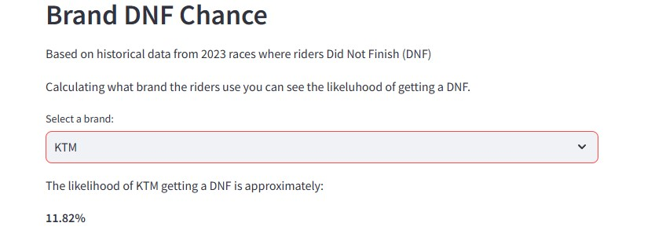

# Emx-seeder
The "emx-seeder" project aims to streamline rider placements in motorsport Enduro races using historical data analysis. Leveraging the CRISP-DM framework, it addresses overtaking risks by seeding riders based on past performance. It collects and refines race data from "Vintercupen 2023," providing tools for riders to track trends. Through a Streamlit app hosted on Heroku, the project offers functionalities for seeding riders, visualizing ranks, assessing brand-related DNF probabilities, and exploring class-based data plots. It delivers a comprehensive toolset for effective seeding and performance analysis in Enduro racing.

# Demo
Streamlit applicaton at Heroku:
<a href="https://emx-ranks-and-seeding-65c93a724d49.herokuapp.com/" target="_blank">https://emx-ranks-and-seeding-65c93a724d49.herokuapp.com/</a>

# CRISP-DM


The Cross Industry Standard Process for Data Mining (CRISP-DM) is a process model that serves as the base for a data science process. It has six sequential phases:

1. Business understanding – What does the business need?
2. Data understanding – What data do we have / need? Is it clean?
3. Data preparation – How do we organize the data for modeling?
4. Modeling – What modeling techniques should we apply?
5. Evaluation – Which model best meets the business objectives?
6. Deployment – How do stakeholders access the results?

# Business understanding
In the motorsport Enduro. There are several security aspects to consider. A lot can be managed by good knowledge and keep to the regulations by the event management. But one aspect is the riders themselves. According to the Swedish Enduro Regulations; if a driver is caught, he must let a faster driver pass. When driving fast on narrow paths in the forest, it can be hard to do this in a safe way. And it's up to the slower rider let the faster driver pass in a safe way. Of course, there are drivers who during the competition become very competitive and do not want to let anyone pass. In order to minimize the amount of passes needed to be done. Riders are often seeded, with the fastest rider starting first. Seeding riders is always a hard thing to do and often creates irritation among some drivers who think they are faster than they are. Today's seeding system is often up to the "person in charge of timing" and the skills and knowledge of how to seed is very different, therefore seeding can be off. If a ranking system of riders can be handles via ML and AI. The seeding system can be correct.

## Hypothesis
* 1 - We know that overtakes while riding enduro in forests on narrow trails can be hard and dangerous. In order to avoid as much overtakes as possible, the start field of riders needs to be seeded.
* 2 - There are manually seeding systems done in excel today, thay require a lot laying hand on manually to fix them to be good.

# Data understanding
The dataset is sourced from a timing solution at [https://live.emx-timing.se]. From all the races called "Vintercupen 2023". It's an enduro competition series that include six races with different classes.

# Data preparation
The competitions took place at FMKC Skövde, Tidaholms MK, Töreboda MK, Tibro MK, Carlsborgs MK and Falköpings MK. The data can be expanded by adding results from earlier years. But for this project the results from year 2023 will be good enough.
Each row represents a rider with data like Placement, Class, StartNo., Name, Club, Brand, LapTimes, Laps, TotalTime. The data is in Swedish, but I think any english speaking person will still understand the data.
To collect the data I first tried using Pandas to collect data from a table at a specified URL. As that was not successful, I also tried using Beatuifulsoup. That didn't work either because of the tables where generated by JavaScript. I think there are solutions to handle that but I didn't want to spend that amount time to test and try so I decided to manually copy the tables into commadelimited CSV-files and made some manual cleaning of unwanted columns. But I choose to keep some data I know I didn't want, in order to use Jupyter Notebook to load the data into dataframes and clean the data and save to new csv-files.


## Business Requirements
As a Data Analyst and awesome with predictions from my Predictive Analytics course at Code Institute. I can help motorsport, and specially Enduro management to seed riders for upcoming races. Also, individual riders should be able to view their results and how they are trending by they results.

* **Project Terms & Jargon**
	* A client is a person that manage events for motorsport. In this case for Enduro competitions.
	* A rider is an indiviual that is participating in an event.

* 1 - The client is interested in seeding riders that has signed up for races, based on their previous results, to get a start list with hopefully the fastest rider first and the slowest last. This to minimize the amount of overtakes the riders have to do.
* 2 - The riders want to follow up on their results to see the trend. If they are getting faster or slower compared to the other riders.


## Use ML to rank a rider from a prediction of how well the rider can perform.
* **Business Requirement 1:** Predict seeding from ranking based on historical results.
	* We will inspect the data available from previous events.
	* Based on lap times, and dropping the slowest lap from each competition, get a "real" average time for each rider.
	* Be able to provide a start list with names of riders and compare the names of riders to sort out a seeded list.
    * We want to predict riders result based on old results.

* **Business Requirement 2:** Data Analysing
	* We want a rider to be able to look up themself or any other rider to present a diagram of results and see a trend line.
	* We want a rider to be able to compare themself to other riders.

* **Bonus**
	1. For fun, made it possible to se the chance of not finish a race (DNF) depening on the brand on motorcycle. Based in historical data of riders DNF.
	2. There are always people interested in statistics. Therefore I would like to display plots for:
		* Average Rank by Klass
		* Scatterplot of Rank
		* Frequency Distribution of Klass
		* Box Plot of AvgRank by Klass  


# Modeling

First I did the Seeding Riders to meet the business requirement 1.  
It was hard to understand what models to use for this project. I ended up using Numpy, Pandas, Matplotlib and Seaborn.  
I went through the XGBoost exercise on Kaggle, thinking I could use that but was unable to fit it to my data.

Then I wanted to do an other way of seeding riders according to the business requieremen 1.
I used Imputation and Prediction.
- Handles missing values using KNN imputation.
- Creates a Linear Regression model to predict the ranking.

# Evaluaton
I first tried using XGBoost but after some time I gave up, thinking I needed to perhaps change the whole project with any other data.  
I briefly had a test with Scikit-learn library, Linear Interpolation, K-Nearest Neighbors (KNN) and Multiple Imputation by Chained Equations (MICE).  
With Pandas and Matplotlib I felt that I had control over what was happening. Using other models just seem to mess up the data and the outcome was not as I expected.
I tried a lot of various plots but nothing really made sense to the Business Requirement. But still fun to try and test to learn.

# Work progress

## Starting up.
1. Installed Jupyterlab, Pandas, Matplotlib and Seaborn - pip3 install jupyterlab pandas matplotllib seaborn
2. Installed Jupyter Notebook - pip3 install notebook
3. Set c.NotebookApp.allow_remote_access = True in jupyter_notebook_config.py
4. Installed required libraries along the way they were needed.

Launch Notebook with: jupyter notebook --NotebookApp.token='' --NotebookApp.password=''  
Launch Streamlit app: streamlit run app.py

Codeanywhere workspace got really slow and at one time it went offline and I wasn't able to start the Jupyter Notebook again. Just got 403 error. After half a day trying to solve it, I switched to VS Code. That was also a couple of hours learning how to set that up.

### Jupyter Notebook

The work of taking care of, cleaning and sorting data was made using Jupyter Notebooks.  
I have created six notebook pages to be able to collect, clean, use and visualize the data.
- The first notebook page is just about collecting the data from CSV-files clean them and then save the dataframes as new CSV-files.  
   

- Second page is about sorting out the data needed to reach the business requirements  


- Third page is to make plots to show riders ranking according to business requirement 2.  


- Fourth page is used to do some ML to predict and seed rider for upcoming events and reach business requriement 1.  


- Fifth page. Where some analysis of how many occurrances there is of each brand. Which rider rides which brand.  
And from that sort out how many that did not finish (DNF) a race. Use that data to find out the likelihood that a used brand will get a DNF  


- Sixth page is for plotting. Using the Klass (Class) data and how different data can be plotted.  


- Seventh page is where I did some testing. It really doesn't give much.

- Page Eight. KNN imputation and Linear Regression to predict ranks  


# Deployment

## IDE and hosting.
- Github - For version control and hosting work.
- Codeanywhere - Started working in the Codeanywhere IDE. But soon I got frustrated with it being slow and have issues so I choose not to continue with it.
- Visual Studio Code - Installed it on my computer and learned how to connect it to both GitHub and Heroku.
- Heroku - to make final deployment and run the Streamlit application.

## Dashboard Design (Streamlit App User Interface)

### Page 1: About
* Descriptions about this project.

### Page 2: Quick project summary
* Quick project summary
	* Summary
	* App Structure
	* Key Functionalities
	* Main Data Used
	* Features
	* Next Steps

### Page 3: Seeding Riders
* Before the analysis, we knew we wanted this page to answer business requirement 1. 
* After data analysis, it should be a possibility to downlaod a file with seeded riders: 
	* State business requirement 1
	* Able to upload a commadelimited csv-file with rider participating in an upcoming event. File columns must be: 'Place of event,Year,#(StarNo.),Namn(Name),Klubb(Club),Märke(Brand),Klass(Class),'
	* Process the file data
	* Download a new csv-file containing seeded riders.
	* Visually see the seeded riders on the page.
* Image showing when a uploaded csv-file has been processed:  
  
If no csv-file is available for uplaoding. You can use the button "Use system data" to use csv-file that is uploaded with preexisting data.  


### Page 4: AI Seeding Riders
* This page uses the idea from the "Seeding Riders" page. Just do it with data with
	* Imputation and Prediction:
	* Handles missing values using KNN imputation.
	* Creates a Linear Regression model to predict a 'Predicted_Rank' based on existing ranking columns.
* After data analysis, it should be a possibility to downlaod a file with seeded riders: 
	* State business requirement 1
	* Able to upload a commadelimited csv-file with rider participating in an upcoming event. File columns must be: 'Place of event,Year,#(StarNo.),Namn(Name),Klubb(Club),Märke(Brand),Klass(Class),'
	* Process the file data
	* Download a new csv-file containing seeded riders.
	* Visually see the seeded riders on the page. 
* Image showing a table with seeded riders using AI:  
  

### Page 5: Riders rank 2023
* State business requirement 2:
	* Select a Klubb (Swedish for Club)
	* Select one or more riders
	* Plot a line chart for selected riders to see their ranks during competitions
* Image showing a bunch of riders selected showing their ranks:  
  

### Page 6: Brand DNF Chance
* Select a brand from used motorcycle brands during competition and see how likely they will get a DNF.
* Image showing the brand KTM seleced and the chance of get a DNF:  
  

### Page 7: Class Plots
* Multiple Plot Types:Offers a selection of different visualizations, including:
	* Bar plots  
	  
	* Scatterplots  
	 
	* Histograms  
	 
	* Box plots  
	 
* Interactive Visualization: Enables users to toggle the visibility of different plots using  radio buttons, allowing one plot to be displayed at a time for clear and focused exploration.
* Plot Descriptions: Provides concise descriptions alongside each plot option, aiding users in understanding the content and purpose of each visualization before making a selection.
* Data Exploration: Facilitates an exploration of class rankings, average ranks, and frequency distributions through interactive and informative plots.

This tool simplifies the exploration and understanding of ranking data by offering a user-friendly interface with selectable plot options and accompanying descriptions, empowering users to gain insights from their datasets effortlessly.

# Bugs

I didn't encounter any real bug during this project.
However, some code gave me warnings about being old.
For example this:
PyplotGlobalUseWarning: You are calling st.pyplot() without any arguments. After December 1st, 2020, we will remove the ability to do this as it requires the use of Matplotlib's global figure object, which is not thread-safe.
```
To future-proof this code, you should pass in a figure as shown below:

>>> fig, ax = plt.subplots()
>>> ax.scatter([1, 2, 3], [1, 2, 3])
>>>    ... other plotting actions ...
>>> st.pyplot(fig)

You can disable this warning by disabling the config option: deprecation.showPyplotGlobalUse

st.set_option('deprecation.showPyplotGlobalUse', False)

or in your .streamlit/config.toml

[deprecation]
showPyplotGlobalUse = false
```  
Spending some time trying to solve it but I could not. So I went for the option to disable the warning as suggested in the warning message.  

I went back to try to solve this warning issue again. And spent almost a half day with googling. Found this topic on streamlit forum <a href="https://discuss.streamlit.io/t/pyplotglobalusewarning/6578" taget="blank">discuss.streamlit.io</a> and event tried various solutions with ChatGPT but I couldn't change the code to solve it.

# Future Featuers
I can think of bunch of features to implement in the future. For example:
- Sort the seeded riders by class
- Select what classes to be exported in the CSV file in the Streanlit app.
- Test different models to train AI to rank and seed riders. For example

# Credits

- <a href="https://learn.codeinstitute.net/" target="_blank">https://learn.codeinstitute.net/</a> - Using the walthrough project two, Churnometer as a template for Jupyther and Streamlit.
- <a href="https://www.kaggle.com/" target="_blank">https://www.kaggle.com/</a> - The Learn section and XGBoost exercise.
- <a href="https://www.datascience-pm.com/crisp-dm-2/" target="_blank">https://www.datascience-pm.com/crisp-dm-2/</a> - for the image of CRISP-DM.
- <a href="https://chat.openai.com/" target="_blank">https://chat.openai.com/</a> - ChatGPT to get help to fix issues and get advice on how to use models.
- <a href="https://www.online-spellcheck.com/" target="_blank">https://www.online-spellcheck.com/</a> - for grammar an spelling.

## Acknowledgement
During this fifth module and just I started with my PP5, my whole family got a vomiting sickness in turns. My children 3 and 5 years old had to be home from daycare and as well as myself being sick and in bed for three days. In total I lost about two weeks of time. But I think I have done what I can.
